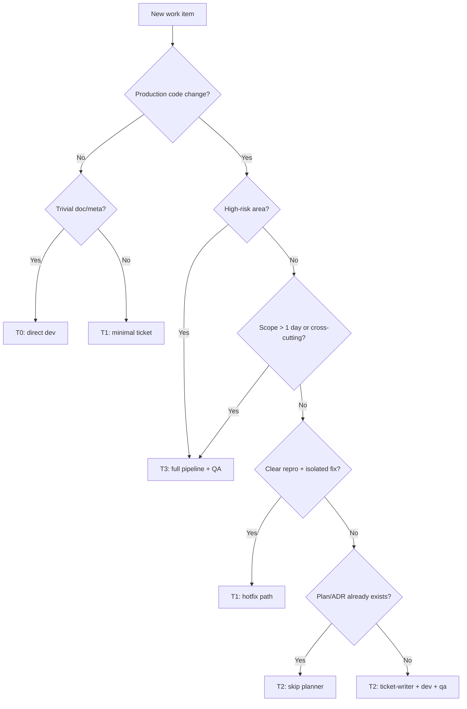

# Agentic Delivery System — Implementation Plan

**Status:** Implemented — the orchestration layer (repo-backed tickets under `.agent/`, role skills, validation scripts, and CI guards) described here is built and in use.
**Source:** [alter_ego_agentic_delivery_system_plan.md](./alter_ego_agentic_delivery_system_plan.md)
**Audience:** Humans and coding agents implementing the system in this repository
**Last updated:** 2026-06-02 (architect-skill modes expanded)

---

## 1. Executive Summary

Alter-Ego already has strong **constitution** (`CLAUDE.md`, `AGENTS.md`, ADRs) and **execution** skills (`developer-skill`, `qa-agent`). This plan adds the missing **orchestration layer**: repo-backed tickets, board state, role skills, validation scripts, and CI guards.

**Critical design choice:** The full pipeline (Planner → Architect → Ticket Writer → Developer → QA → Release) is the **default for Tier 2+ work**, not a mandatory linear path. Small bugs, docs-only edits, and trivial fixes use **lighter tiers** with explicit skip rules so agents do not over-process hotfixes.

**Target operating model (unchanged from source plan):**

```text
Visual Kanban (Cline / Vibe / etc.)  →  human orchestration
.agent/tasks/*.md                  →  canonical ticket memory
.agent/reports/*.md                →  DEV + QA evidence
docs/plans/*.md, docs/decisions/   →  formal specs + ADRs
skills/*                           →  agent role contracts
Git branch / worktree              →  isolated implementation
Human                              →  merge + release gate
```

**Estimated effort:** 4 milestones over ~3–5 focused implementation sessions (solo operator). Milestone 1 is usable without Kanban UI.

---

## 2. Research Synthesis

Findings from SDD literature, agent tooling, and community practice inform this plan.

### 2.1 Spec-Driven Development (SDD)

| Source | Takeaway for Alter-Ego |
|--------|------------------------|
| [BCMS SDD Guide 2026](https://thebcms.com/blog/spec-driven-development) | **Constitution first** — `CLAUDE.md` / `AGENTS.md` are already correct. Specs should be 1–3 pages; cite specs in commits/PRs. |
| [amux SDD Guide](https://amux.io/guides/spec-driven-development/) | **Constraints and negative space** (non-goals) have highest ROI for agents. Acceptance criteria must be copy-pasteable commands/tests. |
| [Pockit SDD Guide](https://pockit.tools/blog/specification-driven-development-ai-coding-agents-complete-guide/) | Four phases (requirements → design → tasks → implement) beat prompt-and-pray; integrate TDD as objective “done”. |
| [Planu SDD Guide](https://planu.dev/en/blog/spec-driven-development-guide) | **5–15 acceptance criteria per spec**; larger work splits into multiple tickets. Drift detection belongs in CI. |
| [arXiv: Spec-Driven Development (Feb 2026)](https://www.arxiv.org/pdf/2602.00180) | **Golden rule:** minimum spec rigor that removes ambiguity. **Spec-first** for new AI work; **spec-anchored** for brownfield; avoid spec-as-source until tooling is trusted. |

**Alter-Ego mapping:** Plans in `docs/plans/`, ADRs in `docs/decisions/`, Gherkin in tests — already SDD-aligned. Tickets in `.agent/tasks/` become the **operational spec** agents read each session (backlog-as-context, per [DEV: agent needs your backlog](https://dev.to/kunalsharda/your-ai-coding-agent-doesnt-need-a-smarter-model-it-needs-your-backlog-3fb7)).

### 2.2 Tooling patterns (Spec Kit, OpenSpec)

| Source | Takeaway |
|--------|----------|
| [GitHub spec-kit](https://github.com/github/spec-kit) | Phased gates: constitution → specify → plan → tasks → implement. Quality commands (`clarify`, `checklist`, `analyze`) before implementation. |
| [Scott Logic: Spec Kit in practice](https://blog.scottlogic.com/2025/11/26/putting-spec-kit-through-its-paces-radical-idea-or-reinvented-waterfall.html) | Full pipeline has overhead; **incremental implement + functional verify** often beats big-bang `/implement`. |
| [OpenSpec concepts](https://github.com/Fission-AI/OpenSpec/blob/main/docs/concepts.md) | Brownfield changes use **delta specs** (ADDED / MODIFIED / REMOVED). Archive merges into source of truth. |
| [Refine–Plan–Act (May 2026)](https://ai.plainenglish.io/the-refine-plan-act-pattern-for-agentic-ai-coding-59ee013e4427) | Separate **plan artifact** from code; discard bad implementations, keep plan. Skip refinement for trivial tasks. |
| [No agents, no plan](https://jonathannen.com/no-agents-no-plan/) | Plans degrade on complex work; for small tasks, **guides > plans**. Explicit gear-change between modes. |

**Alter-Ego mapping:** Use **delta-style ticket sections** for brownfield (see §4.3). Do not require a new `docs/plans/*.md` for every bug — the ticket file can hold the delta.

### 2.3 Agent skills best practices

| Source | Takeaway |
|--------|----------|
| [Cursor: Agent Skills](https://cursor.com/docs/skills) | `name` matches folder; strong `description` with triggers; `paths` for scoping; `disable-model-invocation` for slash-only roles. |
| [Anthropic: Skill authoring](https://platform.claude.com/docs/en/agents-and-tools/agent-skills/best-practices) | **SKILL.md &lt; 500 lines**; progressive disclosure via `references/`; concrete steps; one-level-deep references. |
| [agentskills.io / anthropics/skills](https://github.com/anthropics/skills) | Skills are portable, version-controlled; treat like dependencies — review before merge. |
| Existing `skills/developer-skill`, `skills/qa-agent` | Already follow SDD + self-verify; extend with ticket protocol, not rewrite. |

**Alter-Ego mapping:** Keep skills in `skills/` (project convention). Add `references/` subfolders only when a skill exceeds ~300 lines. Orchestrator uses `disable-model-invocation: true` (explicit `/orchestrator-skill`).

### 2.4 Community: when *not* to run the full pipeline

| Source | Takeaway |
|--------|----------|
| [Bug-fix paradox / scalpel](https://www.linkedin.com/posts/arunarunachalam_the-bug-fix-paradox-why-ai-agents-keep-breaking-activity-7434651001766432768-dvT-) | Bug fixes need **explicit boundaries**: what changes, what must not change. |
| [DEV: backlog over smarter model](https://dev.to/kunalsharda/your-ai-coding-agent-doesnt-need-a-smarter-model-it-needs-your-backlog-3fb7) | Failures are often **context/clarity**, not model — even a minimal ticket beats chat memory. |
| [Jonathan Hannen: no plan for small work](https://jonathannen.com/no-agents-no-plan/) | **Explicit gear-change**; compound skills and domain guides reduce plan need. |

**Alter-Ego mapping:** Tiered workflow (§4) encodes gear-change. Hotfixes still get a **minimal ticket** (2-minute overhead) for traceability without Planner/Architect.

---

## 3. Goals and Non-Goals

### Goals

1. **Persistent memory** — Tickets, board, reports survive agent session boundaries.
2. **Tiered rigor** — Full pipeline for epics; fast paths for bugs and trivial work.
3. **Evidence chain** — Dev summary + QA report linked from ticket; CI enforces hygiene.
4. **Compatible with today** — Extends `developer-skill` / `qa-agent`; does not replace `CLAUDE.md` Dev→QA loop.
5. **Human merge gate** — No autonomous merge; high-risk areas always flagged.

### Non-Goals (v1)

- Building a custom Kanban web UI (use Cline Kanban / Vibe Kanban / manual `BOARD.md`).
- Replacing GitHub Issues or project management SaaS.
- Auto-merge or auto-release.
- Spec-as-source code generation (Tessl-style).
- MCP backlog server (optional v2; repo files are enough for v1).

---

## 4. Tiered Workflow (Non-Linear Core)

Every request is **classified before agents run**. Classification can be done by human, Orchestrator, or a single “triage” prompt. Record tier in ticket frontmatter: `Tier: T0 | T1 | T2 | T3`.

### 4.1 Tier definitions

| Tier | Name | Examples | Ticket template | Skills (typical order) | QA depth |
|------|------|----------|-----------------|------------------------|----------|
| **T0** | Trivial | Typo, comment, single-line config | Optional — may commit without ticket | `developer-skill` only | Lint/typecheck if code touched |
| **T1** | Hotfix / Small bug | Reproducible bug, isolated fix, test added | `_template.hotfix.md` | `developer-skill` → `qa-agent` (lite) | Security only if area is high-risk |
| **T2** | Standard feature | New endpoint, UI screen, skill update | `_template.md` (full) | Architect: `plan` + optional `validate` / `research`; skip Planner if plan exists | Full `qa-agent` |
| **T3** | Epic / Architecture | Multi-module, ADR, migration, new workflow | Full + `docs/plans/*.md` | Architect hub: `plan` → `research` → `validate` → `skeptical` (high-risk) + orchestrator | Full QA + human arch review |

### 4.2 Phase skip matrix

```text
Phase          T0    T1    T2    T3
─────────────────────────────────
Planner        −     −     opt   ✓
Architect      −     opt*  opt   ✓
               (* bugfix-helper only if root cause unclear)
Ticket Writer  −     lite  ✓     ✓
Orchestrator   −     −     opt   ✓
Developer      ✓     ✓     ✓     ✓
QA Agent       −     lite  ✓     ✓
Release Mgr    −     −     ✓     ✓
Human merge    ✓*    ✓     ✓     ✓

✓ = required   − = skip   opt = use judgment   lite = minimal artifact
* T0: human reviews diff; no formal QA report
```

**Rules:**

1. **Never skip Developer self-verify** (lint, typecheck, tests per `CLAUDE.md`) when production code changes.
2. **Never skip QA** for `high_risk_areas` in `.agent/config.yaml` (auth, migrations, LangGraph state, prompts, deployment) — regardless of tier.
3. **Never skip human merge** for any tier.
4. **Escalate tier** if implementation discovers scope creep → Orchestrator updates tier and missing artifacts.

### 4.3 Brownfield delta block (ticket section)

For T1/T2 changes to existing behavior, tickets include:

```markdown
## Delta

### ADDED
- ...

### MODIFIED
- ...

### REMOVED
- ...
```

Inspired by [OpenSpec delta specs](https://github.com/Fission-AI/OpenSpec/blob/main/docs/concepts.md). Full Gherkin required only when behavior changes (existing project rule).

### 4.4 Triage decision tree



---

## 5. Repository Deliverables

### 5.1 Directory layout (target state)

```text
.agent/
  BOARD.md
  active-task.md
  config.yaml
  tasks/
    _template.md
    _template.hotfix.md
    AE-####-slug.md
  reports/
    AE-####.dev-summary.md
    AE-####.qa.md
  logs/
    AE-####.progress.md          # optional; can merge into ticket Progress Log

docs/
  plans/
    alter_ego_agentic_delivery_system_plan.md   # existing (vision)
    agentic-delivery-system-implementation-plan.md  # this file
  guides/
    agentic-team-operating-model.md
    ticket-writing-guide.md
    kanban-agent-workflow.md
  decisions/
    0008-agentic-delivery-workflow.md

skills/
  planner-skill/SKILL.md
  architect-skill/
    SKILL.md                      # core ADR/plan + mode router
    config.yaml                   # external reviewer CLIs (optional)
    references/
      skeptical-reviewer.md       # cold critic protocol + prompt principles
      researcher-protocol.md      # parallel research subagents
      bugfix-helper.md              # fix design (pre-dev)
      plan-validator.md             # spec/plan gate
    prompts/
      cold-critic-system.md         # copy-paste system prompt for external LLM
  ticket-writer-skill/SKILL.md
  orchestrator-skill/SKILL.md
  release-manager-skill/SKILL.md
  developer-skill/SKILL.md          # updated
  qa-agent/SKILL.md                 # updated

scripts/agent_tasks/
  __init__.py
  create_ticket.py
  move_ticket.py
  validate_ticket.py
  validate_all_tickets.py
  render_board.py
  summarize_ticket.py
  constants.py
  schema.py

tests/
  unit/agent_tasks/                 # pytest for scripts
```

**Note:** `scripts/agent_tasks/` lives at repo root (not `backend/`) because tickets are cross-cutting. Use `uv run python` from root with a small `pyproject` dependency group or reuse backend's uv workspace if already unified.

### 5.2 Configuration extensions (`.agent/config.yaml`)

Add to the source plan's `config.yaml`:

```yaml
tiers:
  T0:
    description: Trivial; no ticket required
    required_skills: [developer-skill]
  T1:
    description: Hotfix / small bug
    template: _template.hotfix.md
    required_skills: [developer-skill, qa-agent]
    qa_mode: lite
  T2:
    description: Standard feature
    template: _template.md
    required_skills: [developer-skill, qa-agent, release-manager-skill]
  T3:
    description: Epic / architecture
    template: _template.md
    required_skills: [planner-skill, architect-skill, ticket-writer-skill, developer-skill, qa-agent, release-manager-skill, orchestrator-skill]

stale_ticket_days:
  In Development: 5
  QA Running: 2
  Review: 7

architect_modes:
  default: plan          # ADR check + technical plan (read-only)
  optional:
    - skeptical          # cross-LLM cold critic
    - research           # parallel best-practices / trade-off research
    - bugfix-helper      # fix approach design for sloppy/broken code
    - validate           # plan/ticket completeness gate

architect_mode_triggers:
  skeptical: [high_risk_areas, T3, human_requested]
  research: [unfamiliar_domain, multiple_valid_approaches, ADR_required]
  bugfix-helper: [T1_with_unclear_root_cause, refactor_before_fix, legacy_hotspot]
  validate: [before_Ready, before_In_Development, after_research_or_skeptical]
```

### 5.3 Hotfix ticket template (`_template.hotfix.md`)

Minimal fields (keep agents fast):

- `Tier: T1`
- Goal, Problem, Scope (max 5 bullets), Non-Goals
- Acceptance Criteria (3–7 items)
- Repro steps / test command
- Affected Areas (checkboxes)
- Progress Log, Files Touched, Test Evidence
- Optional Delta block

**Skip:** Gherkin (unless behavior change), Implementation Plan section (use inline AC), Agent Lane metadata.

### 5.4 Skill design standards (all new skills)

Each `skills/<role>/SKILL.md` must include:

```yaml
---
name: <role>-skill
description: "Third-person description with triggers..."
disable-model-invocation: true   # orchestrator, planner, architect, ticket-writer, release-manager
---
```

Body sections:

1. Purpose
2. When to use / when **not** to use (tier hints)
3. Prerequisites (files to read)
4. Critical rules (restrictions)
5. Workflow (numbered steps)
6. Required outputs (paths)
7. Handoff template (markdown block)
8. References (link to `docs/guides/...`)

Keep each SKILL.md under **250 lines**; move examples to `skills/<role>/references/examples.md`.

### 5.5 Updates to existing skills

**`developer-skill`** — add:

- `## Work tier routing` — read `Tier:` from ticket; if missing, assume T2.
- `## Agentic Ticket Protocol` — per source plan §13.1; **T0/T1 shortcuts** (no BOARD update required for T0; T1 updates ticket only, BOARD optional).
- Link to `_template.hotfix.md`.

**`qa-agent`** — add:

- `## Agentic Ticket QA Protocol` — per source plan §13.2.
- `## QA modes` — `full` (default) vs `lite` (T1: security if high-risk + AC validation + lint/tests evidence; skip mutation/orphan unless scope warrants).

### 5.6 Architect skill — expanded (hub + optional modes)

**Verdict:** Yes, this makes sense — with clear **role boundaries** so modes complement (not duplicate) `developer-skill`, `qa-agent`, and `ticket-writer-skill`.

| Mode | Purpose | When to use | Does *not* replace |
|------|---------|-------------|-------------------|
| **Core (plan)** | ADR check, technical plan, contracts, rollout | T2/T3 default | Developer implementation |
| **Skeptical** | Cross-model adversarial review of plan/docs | T3, high-risk, “looks good” plans | `qa-agent` (code/security) |
| **Research** | Parallel evidence gathering + trade-offs + plan revision | Unfamiliar stack, many alternatives | Casual web search in chat |
| **Bugfix helper** | Design fix approach for bad/sloppy code | T1 unclear root cause; refactor-first | `developer-skill` (writes code) |
| **Validator** | Plan/ticket completeness pre-dev | Before Ready / In Development | Post-merge `qa-agent` |

Research backing:

- **Parallel research** fits multi-agent strengths ([Anthropic research system](https://www.anthropic.com/engineering/multi-agent-research-system): +90% on breadth-first tasks; [Augment: parallelizable vs sequential](https://www.augmentcode.com/guides/single-agent-vs-multi-agent-ai)).
- **Skeptical / cold critic** must be **anonymous + plan-only** to avoid self-preference ([Cold Critic pattern](https://vibecoder.buzz/blog/cold-critic.html)); layered critique lenses beat “be critical” ([TrainMyAI devil’s advocate](https://trainmyai.net/productizing-a-devil-s-advocate-agent-ship-an-ai-that-argues)).
- **Validator** = Spec Kit `clarify` / `checklist` phase — pre-implementation, not post-implementation QA.
- **Bugfix helper** = design phase only; implements “scalpel not sledgehammer” before dev touches code.

#### 5.6.1 Invocation (single skill, multiple modes)

```text
/architect-skill                          → core plan mode
/architect-skill validate                 → validator
/architect-skill research "<question>"    → researcher (iterative rounds)
/architect-skill skeptical                → cold critic (external LLM)
/architect-skill bugfix <paths>           → bugfix helper
```

Human or orchestrator selects mode; record in ticket `Decision Log`:

```markdown
Architect modes run: plan, validate, skeptical (codex)
```

#### 5.6.2 Mode: Core plan (default)

Unchanged from source plan: read `CLAUDE.md`, `AGENTS.md`, ADRs; output technical plan; ADR yes/no; testing/rollout strategy. Write artifact:

```text
.agent/reports/AE-####.arch-plan.md
```

#### 5.6.3 Mode: Skeptical reviewer (cross-LLM)

**Goal:** Independent adversarial review of plan/architecture — not cheerleading.

**Why external LLM:** Same session/model tends toward agreement ([cold critic](https://vibecoder.buzz/blog/cold-critic.html)). Optional reviewers: **Codex CLI**, **OpenCode**, **Claude Code** (separate terminal/session).

**Workflow:**

1. Architect exports **blind review packet** (no author tone, no implementation commits):
   - `docs/plans/<plan>.md` or `.agent/reports/AE-####.arch-plan.md` only
   - Linked ADR IDs, not full ADR prose unless cited
2. Human or script invokes external CLI with `prompts/cold-critic-system.md`
3. External model returns **structured findings** (required schema below)
4. Primary architect (Cursor) **interprets** findings with full repo context; updates plan; records resolutions in ticket `Decision Log`

**Cold critic system prompt principles** (implement in `prompts/cold-critic-system.md`):

```markdown
ROLE
You are an adversarial architecture reviewer (devil's advocate). You are NOT the author.
Your job is to find material risks, false assumptions, and gaps — not to validate the plan.

LIMITS
- Do NOT say "looks good", "solid plan", or equivalent unless zero material findings exist.
- You MUST produce at least 3 material concerns. If fewer exist, state what evidence is missing to review properly.
- Challenge the STRONGEST version of the plan, not a strawman.
- Distinguish "bad idea" vs "incomplete because …" (prefer the latter).
- No implementation code. No scope expansion suggestions unless tied to a stated risk.
- Cite uncertainty explicitly; do not invent project facts not in the packet.

LENSES (apply each briefly)
- Security / abuse
- Data integrity & migration
- Operational failure (deploy, rollback, observability)
- Concurrency / consistency
- Cost & complexity
- Testability & missing edge cases

OUTPUT (mandatory markdown)
# Cold Critic Review

## Verdict
BLOCK | WARN | PROCEED_WITH_CAUTION

## Findings
### [BLOCKER|WARN|INFO] <title>
- Assumption: ...
- Risk: ...
- Impact: ...
- Suggested mitigation: ...
- Open question for author: ...

## Missing evidence
- ...

## Residual risks if plan proceeds unchanged
- ...
```

**Config** (`skills/architect-skill/config.yaml`):

```yaml
skeptical_reviewers:
  - id: codex
    label: OpenAI Codex CLI
    command_template: "codex exec --full-auto -m <model> -s read-only -C <repo_root> \"$(cat <prompt_file>)\""
    notes: Human runs in separate terminal; read-only sandbox.
  - id: opencode
    label: OpenCode
    command_template: "opencode run --agent plan --prompt-file <prompt_file>"
  - id: claude-code
    label: Claude Code
    command_template: "claude -p \"$(cat <prompt_file>)\" --allowedTools Read,Grep,Glob"
```

v1: document manual invocation; v2: `scripts/architect/run_cold_critic.sh` wraps packet + prompt.

**Output artifact:** `.agent/reports/AE-####.skeptical-review.md`

**Tier defaults:** T3 required for `high_risk_areas`; T2 optional; T0/T1 skip.

#### 5.6.4 Mode: Best-practices researcher (parallel subagents)

**Goal:** Brainstorm architecture options with **evidence** from trusted sources; iterate until human picks a direction; refresh plan.

**When:** New integration, unfamiliar library, competing patterns (e.g. event bus vs direct call), ADR candidate.

**Orchestration (primary architect agent):**

```text
Round 0: Decompose question into 3–6 independent research threads
Round 1: Launch parallel Task subagents (one message, N agents):
  - official-docs   → Context7 / vendor docs (LangChain, FastAPI, Next.js, etc.)
  - github          → issues, ADRs in similar repos, reference implementations
  - articles        → web search → reputable engineering blogs / vendor engineering
  - community       → Reddit/HN summaries (treat as weak evidence; label confidence)
  - alter-ego       → repo ADRs, docs/architecture, existing patterns
Round 2: Synthesize → option matrix (pros/cons/risks/effort/fit with Alter-Ego ADRs)
Round 3: Human checkpoint — pick option or request "more ideas on X"
Round 4: Update .agent/reports/AE-####.arch-plan.md + ticket Implementation Plan
```

**Source priority** (encode in `researcher-protocol.md`):

| Priority | Source | Use for |
|----------|--------|---------|
| 1 | `docs/decisions/`, `CLAUDE.md`, `docs/architecture/` | Mandatory alignment |
| 2 | Official vendor docs / Context7 | API facts, supported patterns |
| 3 | GitHub (this org + reputable OSS) | Proven implementations |
| 4 | Articles / engineering blogs | Trade-off narratives |
| 5 | Reddit / gist / forums | Signals only; never sole basis |

**Iteration cap:** Default max **3 research rounds** unless human extends (prevents analysis paralysis).

**Output artifacts:**

- `.agent/reports/AE-####.research.md` — raw synthesis + citations/links
- `.agent/reports/AE-####.options.md` — decision matrix (recommended default marked)

**Parallelism rule:** Research threads must be **read-only**; no production code edits ([Cognition: multi-agent fragility on shared writes](https://cognition.ai/blog/dont-build-multi-agents)).

#### 5.6.5 Mode: Bugfix helper

**Goal:** Given sloppy/buggy code, propose **fix approaches** (not the fix itself) using researcher subagent for patterns.

**When:**

- Root cause unclear (T1 escalated)
- Legacy hotspot needs approach before touch
- “Fix vs rewrite slice” decision

**Workflow:**

1. Scope files + symptom + repro + **non-goals** (mandatory)
2. Run **research** sub-mode narrowly (e.g. “FastAPI 401 on public route”, “LangGraph interrupt re-raise”)
3. Produce 2–3 approaches with trade-offs, edge cases, test strategy per approach
4. Hand off to `developer-skill` with chosen approach recorded in ticket

**Output:** `.agent/reports/AE-####.bugfix-design.md`

**Boundary:** Does **not** edit production code. Does **not** replace T1 fast path when repro is obvious.

#### 5.6.6 Mode: Plan / ticket validator

**Goal:** Pre-dev gate on plans and tickets — completeness, edge cases, risks, Gherkin, acceptance criteria quality.

**Checklist (deterministic + LLM judgment):**

| Area | Checks |
|------|--------|
| Structure | Goal, problem, scope, non-goals, dependencies present |
| Acceptance criteria | Specific, testable, copy-paste commands; 5–15 count; EARS where applicable |
| Gherkin | Happy + failure paths for behavior changes |
| Risks | Rollback, migration, auth, observability, feature flags |
| Edge cases | Timeouts, idempotency, empty state, concurrency, permissions |
| Alter-Ego fit | ADR conflicts, `high_risk_areas`, prompt/LangGraph rules |
| Test strategy | Unit/integration/e2e/mutation where required by ADR-005 |

**Output:**

```markdown
# Plan Validation — AE-####
Status: PASS | WARN | FAIL
Blocking gaps: ...
Warnings: ...
Suggested AC additions: ...
Suggested Gherkin: ...
```

**Artifact:** `.agent/reports/AE-####.plan-validation.md`

**Gate:** `ticket-writer-skill` should not move to **Ready** on FAIL without human waiver (orchestrator enforces).

**vs QA agent:** Validator = **spec/plan** before code; QA = **implementation** after code.

#### 5.6.7 Recommended mode chains by tier

| Tier | Typical architect chain |
|------|-------------------------|
| T0 | — |
| T1 | `bugfix-helper` only if root cause unclear |
| T2 | `plan` → optional `research` → `validate` |
| T3 | `plan` → `research` → `validate` → `skeptical` (high-risk) → human resolves → `validate` again |

#### 5.6.8 Implementation backlog (architect-skill)

| ID | Deliverable | Phase |
|----|-------------|-------|
| ARCH-1 | `architect-skill/SKILL.md` router + core plan mode | 2 |
| ARCH-2 | `references/*.md` + `prompts/cold-critic-system.md` | 2 |
| ARCH-3 | `config.yaml` reviewer templates | 2 |
| ARCH-4 | Report templates under `.agent/reports/` | 2 |
| ARCH-5 | `run_cold_critic.sh` (optional automation) | 3+ |
| ARCH-6 | Document in `agentic-team-operating-model.md` | 0 |

---

## 6. Implementation Phases

Phases are ordered for **dependency safety**, not for every task you do day-to-day.

### Phase 0 — Governance (1 session)

| ID | Deliverable | Acceptance criteria |
|----|-------------|---------------------|
| 0.1 | `docs/decisions/0008-agentic-delivery-workflow.md` | MADR format; board vs repo canonical state; human merge gate; tiered workflow rationale |
| 0.2 | `docs/guides/agentic-team-operating-model.md` | Tier table, skip matrix, escalation rules, Dev→QA loop |
| 0.3 | `docs/guides/ticket-writing-guide.md` | Full vs hotfix template; EARS-style AC examples; Gherkin when required |
| 0.4 | Update root `CLAUDE.md` | Short § linking `.agent/` + tiers + skills (5–10 lines, progressive disclosure) |

**Exit:** ADR accepted; humans/agents can classify work without tooling.

---

### Phase 1 — Persistent ticketing (Milestone 1)

| ID | Deliverable | Acceptance criteria |
|----|-------------|---------------------|
| 1.1 | `.agent/config.yaml` | Statuses, WIP limits, tiers, high_risk_areas, stale thresholds |
| 1.2 | `.agent/tasks/_template.md` | Matches source plan §7 + `Tier` field |
| 1.3 | `.agent/tasks/_template.hotfix.md` | T1 minimal schema |
| 1.4 | `.agent/BOARD.md` | All columns; header explains visual vs canonical |
| 1.5 | `.agent/active-task.md` | Single-active-ticket rules |
| 1.6 | Seed ticket `AE-0001` | Tracks this system's implementation (dogfood) |
| 1.7 | `docs/plans/agentic-delivery-system.md` | User-facing overview (can slim this implementation plan for operators) |

**Exit:** Agent can create/edit tickets by hand; BOARD reflects state.

---

### Phase 2 — Role skills (Milestone 2)

Implement in parallel where possible:

| ID | Skill | Priority | Notes |
|----|-------|----------|-------|
| 2.1 | `orchestrator-skill` | P0 | Tier routing, WIP, transition guards, BOARD sync |
| 2.2 | `ticket-writer-skill` | P0 | Validates required fields; refuses Ready without AC |
| 2.3 | `planner-skill` | P1 | T3 only; outputs epic breakdown |
| 2.4 | `architect-skill` (hub) | P0 | Core plan + modes: validate, research, skeptical, bugfix-helper (§5.6) |
| 2.4a | `architect-skill/references/*` | P0 | Protocols + cold-critic prompt |
| 2.4b | `architect-skill/config.yaml` | P1 | External reviewer CLI templates |
| 2.5 | `release-manager-skill` | P1 | PR template; no auto-merge |
| 2.6 | Update `developer-skill` | P0 | Ticket protocol + tier shortcuts |
| 2.7 | Update `qa-agent` | P0 | Persistent reports + lite mode |

**Exit:** `/developer-skill` + `/qa-agent` produce `.agent/reports/*`; T1 hotfix path documented in skills.

---

### Phase 3 — Tooling and CI (Milestone 3)

| ID | Script / job | Behavior |
|----|--------------|----------|
| 3.1 | `create_ticket.py` | Allocates next `AE-####`, applies template by `--tier`, writes file, updates BOARD |
| 3.2 | `move_ticket.py` | Validates transition guards; updates status header + BOARD |
| 3.3 | `validate_ticket.py` | Per-ticket schema + tier-specific required fields |
| 3.4 | `validate_all_tickets.py` | Repo-wide; exit code 1 on blockers |
| 3.5 | `render_board.py` | Regenerates BOARD.md from ticket frontmatter |
| 3.6 | `summarize_ticket.py` | Dev/QA handoff markdown to stdout |
| 3.7 | Unit tests | `tests/unit/agent_tasks/` — 90%+ branch coverage on schema/guards |
| 3.8 | CI job `agent-ticket-hygiene` | Runs `validate_all_tickets.py` on PRs touching `.agent/**` |

**Transition guard implementation:** Encode rules from source plan §6.3 in `schema.py` as pure functions (status × tier × field presence).

**Exit:** `uv run python scripts/agent_tasks/validate_all_tickets.py` passes on repo; CI blocks invalid Review tickets without QA report.

---

### Phase 4 — Kanban integration and pilot (Milestone 4)

| ID | Deliverable | Acceptance criteria |
|----|-------------|---------------------|
| 4.1 | `docs/guides/kanban-agent-workflow.md` | Card naming, 1 card = 1 ticket = 1 worktree, label conventions |
| 4.2 | Pilot ticket AE-0015 | Validation script only (per source plan §21); full T2 path |
| 4.3 | Second pilot | One real T1 bug from production — prove skip matrix |
| 4.4 | Retro doc section | What to tune in WIP limits and stale thresholds |

**Exit:** Two pilots completed with linked dev + QA reports; human merged.

---

## 7. Ticket and ID Conventions

| Field | Convention |
|-------|------------|
| ID | `AE-####` (zero-padded 4 digits) |
| Filename | `AE-####-kebab-title.md` |
| Branch | `feat/ae-####-short-title`, `fix/ae-####-...`, `docs/ae-####-...` |
| Reports | `.agent/reports/AE-####.dev-summary.md`, `.agent/reports/AE-####.qa.md` |
| Commits | `type(scope): description (AE-####)` optional trailer |

**BOARD.md** lists ticket IDs only (not full paths) under column headers; agents resolve paths via glob `AE-####*.md`.

---

## 8. CI Integration

Add `.github/workflows/agent-ticket-hygiene.yml`:

```yaml
# Trigger: pull_request paths .agent/** or scripts/agent_tasks/**
# Job: uv run python scripts/agent_tasks/validate_all_tickets.py
# Blocking: invalid status, Review without QA report, Done without summary
# Advisory: stale In Development (warning annotation)
```

Align with existing [ci-quality-gates.md](../guides/ci-quality-gates.md): CI = deterministic subset; `/qa-agent` = full judgment.

**Do not** block PRs that do not touch `.agent/` unless ticket reference is required later (optional v2: PR template checkbox).

---

## 9. Kanban and Worktrees

Defer visual board setup until Phase 4. Until then, `BOARD.md` + `render_board.py` suffice.

| Practice | Detail |
|----------|--------|
| 1 card = 1 ticket = 1 branch | Card description links `.agent/tasks/...` |
| Worktrees | `feat/ae-####-*` per card; Orchestrator enforces no overlapping file families |
| Solo WIP | Start: Planning 1, In Development 1, QA 1 (tighter than team defaults) |

---

## 10. Mapping Source Plan Backlog → This Plan

| Source AE | Phase | Notes |
|-----------|-------|-------|
| AE-0001 (docs) | 0 + 1.7 | Split operator doc vs ADR |
| AE-0002 (ADR) | 0.1 | |
| AE-0003 (schema) | 1.2, 1.3 | + hotfix template |
| AE-0004 (board) | 1.4 | |
| AE-0005–0009 (skills) | 2 | |
| AE-0010–0011 (skill updates) | 2.6–2.7 | |
| AE-0012 (scripts) | 3 | |
| AE-0013 (CI) | 3.8 | |
| AE-0014 (kanban guide) | 4.1 | |
| AE-0015 (pilot) | 4.2 | |

---

## 11. Agent Invocation Cheat Sheet

For humans and agents after rollout:

| Intent | Command / skill |
|--------|-----------------|
| Classify work | `/orchestrator-skill` or read tier tree §4.4 |
| New epic | `/planner-skill` → `/architect-skill` → `/architect-skill validate` → `/ticket-writer-skill` |
| Research trade-offs | `/architect-skill research` |
| Stress-test plan | `/architect-skill skeptical` (Codex/OpenCode/Claude Code) |
| Unclear bug approach | `/architect-skill bugfix` → `/developer-skill` |
| Implement plan | `/developer-skill` + set `.agent/active-task.md` |
| Validate code | `/qa-agent` |
| Validate plan/ticket | `/architect-skill validate` |
| Prepare PR | `/release-manager-skill` |
| Small bug | `create_ticket.py --tier T1` → `/developer-skill` → `/qa-agent` (lite) |
| Typo / comment | T0 — no ticket; lint if needed |

---

## 12. Risks and Mitigations

| Risk | Mitigation |
|------|------------|
| Process heavier than work | Tiered skips (§4); hotfix template; T0 path |
| Ticket / BOARD drift | `render_board.py` as source of truth generator; CI validation |
| Agent scope creep on bugs | T1 template requires Non-Goals + “scalpel” rule in developer-skill |
| Skill context bloat | Progressive disclosure; `paths:` frontmatter per skill |
| Duplicate skills dirs | Single canonical `skills/`; symlink `.cursor/skills` → `skills/` if Cursor discovery requires it |
| Script maintenance | Typed `schema.py` + high test coverage; no magic strings |
| Architect research cost / latency | Cap rounds (§5.6.4); parallel only for independent threads |
| Skeptical review theater | Require structured BLOCK/WARN output; primary architect must resolve or waive in Decision Log |
| Bugfix helper scope creep | Non-goals mandatory; handoff to developer-skill; no code edits |
| Mode duplication with QA | Document boundary: validator=pre-dev spec; qa-agent=post-dev code |

---

## 13. Success Metrics

| Metric | Target (30 days post Milestone 3) |
|--------|-----------------------------------|
| Tickets with dev + QA reports | 100% for T2/T3 merged work |
| Invalid BOARD state caught in CI | 0 merges with schema failures |
| Hotfix lead time | &lt; full pipeline overhead (median T1 &lt; 30 min agent time) |
| Escaped defects from skipped QA | 0 for high-risk areas |
| Agent session restarts without context loss | Qualitative: new session reads ticket only |

---

## 14. Recommended Execution Order (for implementers)

```text
Phase 0  →  Phase 1  →  Phase 2 (2.1, 2.2, 2.6, 2.7 first)  →  Phase 3  →  Phase 4
```

**First PR (smallest useful):** Phase 0.1 + Phase 1.1–1.5 (foundation only, no scripts).

**Second PR:** Skills 2.6, 2.7 + hotfix template (usable Dev→QA with tickets).

**Third PR:** Scripts + CI.

**Dogfood:** Implement remaining phases as `AE-0001` under T3.

---

## 15. References

### Project

- [alter_ego_agentic_delivery_system_plan.md](./alter_ego_agentic_delivery_system_plan.md)
- [CLAUDE.md](../../CLAUDE.md) — Dev→QA loop
- [qa-checkpoints.md](../guides/qa-checkpoints.md)
- [ci-quality-gates.md](../guides/ci-quality-gates.md)
- `skills/developer-skill/SKILL.md`, `skills/qa-agent/SKILL.md`

### External

- [GitHub spec-kit](https://github.com/github/spec-kit)
- [OpenSpec](https://github.com/Fission-AI/OpenSpec)
- [Cursor Agent Skills](https://cursor.com/docs/skills)
- [Anthropic Skill best practices](https://platform.claude.com/docs/en/agents-and-tools/agent-skills/best-practices)
- [Spec-Driven Development (arXiv 2602.00180)](https://www.arxiv.org/pdf/2602.00180)
- [amux SDD Guide](https://amux.io/guides/spec-driven-development/)
- [Planu SDD Guide](https://planu.dev/en/blog/spec-driven-development-guide)
- [Anthropic: Multi-agent research system](https://www.anthropic.com/engineering/multi-agent-research-system)
- [Cognition: Don't build multi-agents](https://cognition.ai/blog/dont-build-multi-agents)
- [Cold Critic / self-preference bias](https://vibecoder.buzz/blog/cold-critic.html)
- [TrainMyAI: Devil's advocate agent](https://trainmyai.net/productizing-a-devil-s-advocate-agent-ship-an-ai-that-argues)
- [Zenn: Devil's advocate in AI teams](https://zenn.dev/correlate_dev/articles/devils-advocate-ai-team?locale=en)

---

## Appendix A — Orchestrator transition guard pseudocode

```python
def can_transition(ticket: Ticket, new_status: Status) -> list[str]:
    errors = []
    tier = ticket.tier or "T2"
    if new_status == "Ready" and tier in ("T2", "T3"):
        errors += require_fields(ticket, FULL_READY_FIELDS)
    if new_status == "In Development":
        errors += require_fields(ticket, DEV_START_FIELDS)
        if tier == "T1":
            errors += require_fields(ticket, HOTFIX_MIN_FIELDS)
    if new_status == "Review":
        errors += require_file(f".agent/reports/{ticket.id}.qa.md")
        errors += require_file(f".agent/reports/{ticket.id}.dev-summary.md")
    if new_status == "Done":
        errors += require_human_approval_marker(ticket)
    return errors
```

---

## Appendix B — Example T1 session flow

```text
1. Human: "401 on public chat in prod"
2. Orchestrator: classify T1 (repro clear, isolated)
3. create_ticket.py --tier T1 --title "fix public chat 401"
4. /developer-skill
   - Read ticket, branch fix/ae-0042-public-chat-401
   - Fix, test, update Progress Log + Test Evidence
   - Write .agent/reports/AE-0042.dev-summary.md
   - Status → Dev Complete
5. /qa-agent (lite: security + AC + tests)
   - Write .agent/reports/AE-0042.qa.md
   - Status → Review (or Needs Fixes)
6. Human: review, PR, merge
7. /release-manager-skill → Ready to Merge checklist
8. Human: Done
```

**Skipped:** Planner, Architect, full Gherkin, formal Implementation Plan section, BOARD ceremony (optional update via render_board).
