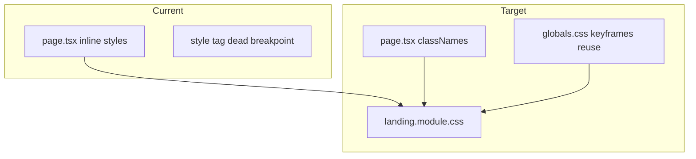

# Landing Page CSS Effects & Responsive Layout

**Status:** `proposed`
**Ticket:** [AE-0003](../../.agent/tasks/AE-0003-landing-page-css-effects-and-responsive-layout.md)
**Branch:** `feat/ae-0003-landing-css-responsive` (suggested)
**Reference mockup:** `frontend/public/redesign/index.html`
**Related:** [DESIGN.md](../../DESIGN.md), [PRODUCT.md](../../PRODUCT.md), [public-shell-ux-fixes](./public-shell-ux-fixes.md)

---

## Executive summary

The production landing page (`app/(public)/(marketing)/page.tsx`) reproduces the neon shell visually but lacks **interaction polish** and **responsive layout** from the hardened redesign mockup. Effects are inline-only (no `:hover` / `:active`), hero typography omits the glitch treatment, and breakpoints are missing (hero stays two-column on mobile; about section never stacks).

This plan ports **only behaviors that apply to sections already on the live page**. Mockup-only sections (Neural Palettes theme grid, bottom CTA block) are explicitly out of scope.

---

## Scope map (mockup → live page)

| Mockup section | On live landing? | In scope |
|----------------|------------------|----------|
| Hero + terminal | Yes | Yes |
| Stats bar | Yes | Yes |
| Neural Palettes (`theme-showcase`) | No | **No** |
| Capabilities / features | Yes | Yes |
| Latest posts | Yes | Yes |
| About | Yes (not in mockup HTML) | Yes (responsive only) |
| CTA section | No | **No** |
| Footer | Yes | Yes (no new copy) |

---

## Issue inventory

| # | Gap | Root cause | Severity |
|---|-----|------------|----------|
| 1 | Buttons have no hover lift/glow | Inline `<Link>` styles, no CSS module | High |
| 2 | Feature/post cards static on hover | Same — no `:hover` / `:active` | High |
| 3 | Hero line 1 lacks glitch | No `.glitch` + `data-text` | Medium |
| 4 | Mobile hero: copy beside terminal | `gridTemplateColumns: 1fr 1fr` hardcoded | High |
| 5 | Features/posts/about don't stack ≤900px | No media queries (dead `.container-posts` rule) | High |
| 6 | Touch users get no feedback | Missing `:active` mirrors | Medium |
| 7 | Stats numbers use gradient text | Violates DESIGN.md redline; mockup also uses gradient | Low (decision) |

---

## Reference specifications (from redesign mockup)

### Button hover (`transition: 0.25s`)

| Variant | Hover |
|---------|--------|
| Primary | `translateY(-2px)`; `box-shadow: 0 0 30px rgba(0,212,255,0.15)` |
| Ghost | `background: rgba(0,212,255,0.15)`; `border-color: #00d4ff`; `translateY(-2px)` |

### Card hover (`transition: 0.3s`)

| Component | Hover |
|-----------|--------|
| `.feature-card-primary` | Border `0.12` → `0.25` cyan; `box-shadow: 0 0 30px rgba(0,212,255,0.04)` |
| `.feature-card-secondary` | Top 2px accent line (teal/purple); `translateY(-4px)`; border lighten |
| `.post-featured` | `translateY(-4px)`; border/glow intensify |
| `.post-sidebar-item` | `background: #111a30` (elevated) |

### Hero white heading

- Line 1: solid `rgba(255,255,255,0.88)` + `.glitch` pseudo-elements (magenta/cyan offset, 3s)
- Line 2: gradient clip on `.highlight` only (Alter-Ego word)

### Responsive breakpoints

| Breakpoint | Key layout changes |
|------------|-------------------|
| `≤900px` | Hero 1 col, terminal `order: -1`, gap 40px; stats 1 col; features 1 col; primary feature stacks; posts 1 col; about 1 col |
| `≤600px` | Hero `min-height: auto`, padding 40px 0; sections 60px vertical; buttons 12px 20px / 14px font |

---

## Target architecture



| Layer | Responsibility |
|-------|----------------|
| `landing.module.css` | Hover, active, breakpoints, glitch, card shells |
| `page.tsx` | Structure, i18n, data; class hooks only |
| `globals.css` | Reuse `pulse-dot`, `glitch-offset` keyframes if added globally |
| `NeonButton` | Optional alignment for `-translate-y-0.5` on hover (hero may stay Link + module) |

---

## Phase 1 — CSS module extraction

**Goal:** Enable pseudo-classes and media queries without inline-style limits.

### Tasks

1. Add `frontend/src/app/(public)/(marketing)/landing.module.css`.
2. Define CSS variables mapping to existing tokens (`--color-neon-cyan`, `--color-bg-elevated`, etc.).
3. Replace layout grids (hero, stats, features, posts, about) with module classes.
4. Remove dead `@media .container-posts` block from inline `<style>`.

**Acceptance (Phase 1)**

- [ ] No regression in desktop layout at 1280px.
- [ ] `npm run typecheck` passes with CSS module imports.

---

## Phase 2 — Button & link interactions

**Tasks**

1. Classes `landingBtnPrimary`, `landingBtnGhost` with hover + `:active` (touch parity per DESIGN.md).
2. Apply to hero CTAs (`Start Chatting`, `Explore Blog`).
3. Social chips in About: ghost-like hover (cyan dim fill).

**Acceptance (Phase 2)**

- [ ] WHEN user hovers primary CTA THE button SHALL lift 2px and intensify cyan glow.
- [ ] WHEN user hovers ghost CTA THE button SHALL fill cyan-dim background and lift 2px.
- [ ] WHEN `prefers-reduced-motion: reduce` THE hover transforms SHALL be disabled.

---

## Phase 3 — Card hover states

**Tasks**

1. Port mockup rules for primary feature, secondary features (with `::before` top accent), featured post, sidebar posts.
2. Use `transition` on `transform`, `border-color`, `box-shadow` only (not grid/layout properties).
3. Duplicate hover under `:active` for touch.

**Acceptance (Phase 3)**

- [ ] WHEN user hovers secondary feature card THE card SHALL show top accent line and lift 4px.
- [ ] WHEN user hovers featured post THE card SHALL lift 4px with stronger border.
- [ ] WHEN user hovers sidebar post item THE background SHALL shift to elevated surface.

---

## Phase 4 — Hero typography (white + glitch)

**Tasks**

1. Wrap `hero.titleLine1` in glitch span with `data-text={t("hero.titleLine1")}` per locale.
2. Add `@keyframes glitch-offset` (or import from globals).
3. Keep `hero.titleHighlight` as sole gradient span.
4. Optional: `pulse-dot` on hero badge (keyframes exist in `globals.css`).

**Acceptance (Phase 4)**

- [ ] WHEN landing loads THE first hero line SHALL render solid white text with glitch effect.
- [ ] WHEN landing loads THE Alter-Ego highlight SHALL remain gradient-only.

---

## Phase 5 — Responsive layout

**Tasks**

1. `@media (max-width: 900px)` — hero stack, terminal first, stats/features/posts/about single column.
2. `@media (max-width: 600px)` — condensed hero/section padding and button sizing.
3. `min-width: 0` on grid children for long i18n strings.

**Acceptance (Phase 5)**

- [ ] WHEN viewport ≤900px THE hero terminal SHALL appear above copy.
- [ ] WHEN viewport ≤900px THE posts grid SHALL be single column.
- [ ] WHEN viewport ≤600px THE hero SHALL not force 85vh min-height.

---

## Phase 6 — Stats styling decision

**Decision required before implementation:**

| Option | Behavior |
|--------|----------|
| A (recommended) | Solid cyan + `text-shadow` per DESIGN.md redline |
| B | Keep gradient to match mockup exactly |

Default in ticket: **Option A**.

---

## Phase 7 — Tests & quality gates

### Gherkin (`frontend/tests/features/landing-page-effects.feature`)

```gherkin
Feature: Landing page CSS effects and responsive layout

  Scenario: Homepage hero stacks on mobile with terminal first
    Given the viewport width is 375
    When I open "/"
    Then the hero terminal appears above the hero heading

  Scenario: Primary CTA has hover lift on desktop
    Given the viewport width is 1280
    When I open "/"
    And I hover the "Start Chatting" link
    Then the primary CTA has a negative translateY transform

  Scenario: Reduced motion disables hover transform
    Given reduced motion is preferred
    When I open "/"
    And I hover the "Start Chatting" link
    Then the primary CTA transform is none
```

### E2E updates (`frontend/tests/e2e/home.spec.ts`)

- Add mobile viewport test for hero order (terminal before h1).
- Optional: visual regression snapshot at 375 / 1280.

### Verification commands

```bash
cd frontend
npm run lint && npm run typecheck && npm run test -- --run
npm run test:e2e -- tests/e2e/home.spec.ts
npm run build
```

---

## File change map

| Action | Path |
|--------|------|
| Add | `app/(public)/(marketing)/landing.module.css` |
| Add | `tests/features/landing-page-effects.feature` |
| Edit | `app/(public)/(marketing)/page.tsx` |
| Edit | `tests/e2e/home.spec.ts` |
| Edit | `app/globals.css` (optional: `glitch-offset` keyframes) |
| Edit | `DESIGN.md` (optional: document landing module pattern) |

---

## Out of scope

- Theme palette showcase section (new UI).
- Bottom CTA section (“Ready to Connect”).
- Header nav underline animation (separate shell ticket if needed).
- Migrating entire page to `NeonButton` / `NeonCard` components (follow-up refactor).
- Parallax grid scroll JS from mockup (not on live page today).

---

## Suggested implementation order

1. Phase 1 (CSS module extraction)
2. Phase 5 (responsive — highest UX impact)
3. Phase 2 (buttons)
4. Phase 3 (cards)
5. Phase 4 (glitch)
6. Phase 6 (stats decision)
7. Phase 7 (tests)

**Estimated effort:** 0.5–1 day focused frontend work.

---

## Revision history

| Date | Change |
|------|--------|
| 2026-06-02 | Initial plan from impeccable harden audit vs `redesign/index.html` |
