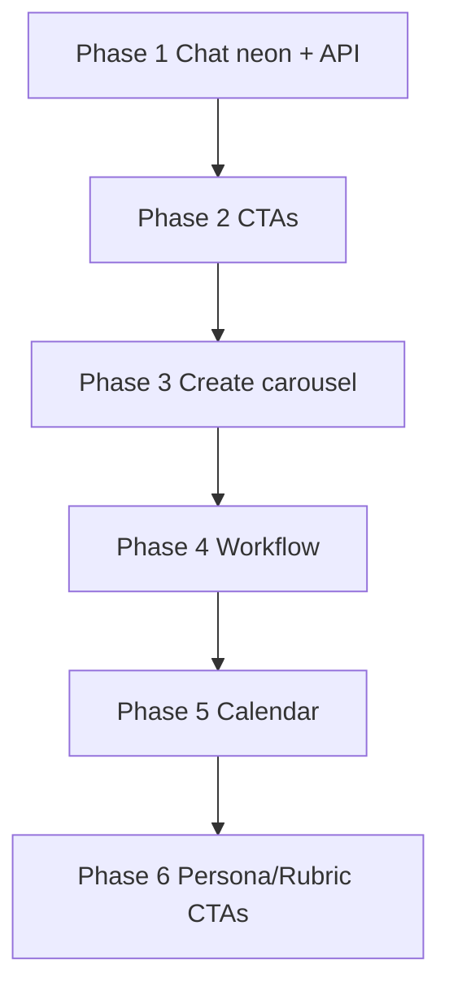

# Neon Dashboard — Backend Integration Plan

**Status:** In progress (regression remediation sprint)
**Branch:** `design-implementation`
**PR:** [#5](https://github.com/rickwalking/alter-ego/pull/5)
**Goal:** Neon shell is **functional** — correct UI, real API data, working navigation and CTAs.

**Legacy removal (detailed inventory & CI guards):** [frontend-legacy-removal.md](./frontend-legacy-removal.md)

---

## Regression Report (2026-05-29 QA)

The first integration pass wired APIs but introduced regressions. **Do not revert to legacy page UIs** (`ChatInterface`, old `/create` TopicForm page). Fix behavior **inside the neon designs**.

| # | Issue | Root cause | Fix (neon-only) |
|---|--------|------------|-----------------|
| R1 | Chat shows **old** sidebar/layout | `dashboard/chat/page.tsx` replaced with `<ChatInterface />` | Restore `ChatHeader` + `ChatSidebar` + `ChatMessageList` + `ChatComposer`; wire `useConversations` + `useSseChat` via adapters |
| R2 | Dashboard quick actions go **nowhere** | `QUICK_ACTIONS` cards have no `href` / `onClick` | Add `href` to each card: `/dashboard/create`, `/dashboard/blog-posts?new=1`, `/dashboard/chat` |
| R3 | **Create carousel** dummy data, no submit | Form sections use `defaultValue`; sidebar button inert | Controlled form state; `IMAGE_PRESETS` + `CAROUSEL_THEMES` from `@/constants/create`; `useCreateCarousel` → `router.push(/create/[id])` |
| R4 | **New blog post** button dead | No handler / route | `createPost` via `useBlogPosts` → redirect `/dashboard/blog-posts/[id]/edit` |
| R5 | **Workflow board** layout broken | `NeonKanbanBoard` lacks column chrome + card links vs mock | Add card `Link` to `/create/[id]`; align column styling with design spec; optional: merge patterns from `WorkflowKanbanBoard` |
| R6 | **New card** on workflow dead | `NeonButton` without `href` | `href="/dashboard/create"` or `onClick` → create flow |
| R7 | **Calendar** static `buildCalendarDays()` | Never wired `useContentCalendar` | Map API `CalendarItem[]` onto month grid by `event_date` |
| R8 | **New rubric** dead | Top bar button decorative | `onClick` → create via `useRubrics().create` (minimal prompt) or `/dashboard/rubrics/new` |
| R9 | **Create persona** dead | `CreatePersonaCard` not interactive | `onClick` → `usePersonas().create` (minimal prompt) or persona form route |

---

## Non-Goals (this sprint)

- Reintroducing `components/ui` or shadcn aliases
- Replacing neon create page with `/(create)/create` TopicForm layout
- Replacing neon chat with `ChatInterface` layout
- Full CRUD modals for personas/rubrics (minimal create OK first)

---

## Architecture Principles

1. **Neon UI is the source of truth** for dashboard presentation.
2. **Reuse hooks** in `features/*/hooks` — no duplicate API clients.
3. **Adapters** in `features/dashboard/*/adapters/` map API → neon props (no `app/` imports from `features/`).
4. **Every CTA must navigate or mutate** — no decorative buttons.

---

## Phase 1 — Chat (P0) — R1

**Files:** `app/dashboard/chat/page.tsx`, `chat-*.tsx`, `features/dashboard/chat/adapters/chat-adapter.ts`

### Tasks

- [ ] Remove `ChatInterface` from dashboard chat route.
- [ ] Add `mapConversationToDashboard()` — `Conversation` → `DashboardConversation` (avatar, preview from title/updated_at).
- [ ] Add `mapMessageToDashboard()` — `Message` → `DashboardChatMessage`.
- [ ] Page orchestration:
  - `useConversations()` → sidebar list
  - `useSseChat({ conversationId })` → message list
  - `useCreateConversation()` on first send / new chat
- [ ] `ChatComposer`: `onSend`, Enter to submit, disable while streaming.
- [ ] `ChatMessageList`: show typing row only when `isStreaming`.
- [ ] New conversation button in sidebar header (optional).

### Acceptance

- [ ] UI matches neon mock (Image #1 chat), not legacy chat.
- [ ] Messages stream via SSE; conversations from `/api/conversations`.

---

## Phase 2 — Navigation & CTAs (P0) — R2, R4, R6

**Files:** `app/dashboard/constants.tsx`, `app/dashboard/page.tsx`, `constants/dashboard-routes.ts`

### Dashboard quick actions

| Action | Route |
|--------|-------|
| New Carousel | `/dashboard/create` |
| Write Blog Post | `/dashboard/blog-posts` (+ create handler) |
| Open Chat | `/dashboard/chat` |

- [ ] Extend `QuickActionConfig` with `href: string`.
- [ ] Wrap `NeonCard` in `next/link` or `router.push` on click.

### Blog “New Post”

- [ ] `NeonButton` calls `create({ title: "Untitled draft", ... })`.
- [ ] Redirect to `/dashboard/blog-posts/{id}/edit`.

### Workflow “New Card”

- [ ] `NeonButton` → `/dashboard/create`.

### Acceptance

- [ ] All three homepage cards navigate correctly.
- [ ] Blog new post opens editor with new UUID.

---

## Phase 3 — Create Carousel E2E (P0) — R3

**Files:** `app/dashboard/create/*`, `constants/create.ts`

### Form state model

```typescript
interface CreateCarouselFormState {
  topic: string;
  audience: string;
  niche: string;
  theme: CarouselTheme;
  imagePreset: string; // IMAGE_PRESETS value
  selectedTemplate: number;
}
```

### Wire to backend

- [ ] Controlled inputs in `CreateTopicSection`, `CreateThemeSection`.
- [ ] Theme `<select>`: `CAROUSEL_THEMES` + `THEME_LABEL_KEYS` (i18n).
- [ ] Image preset `<select>`: `IMAGE_PRESETS` (real model/style pairs).
- [ ] `CreateSidebar` “Start Carousel” → `useCreateCarousel().mutateAsync` → `ROUTE_PATHS.CREATE_WORKSPACE(id)`.
- [ ] Sidebar summary reflects live form state (not `CREATE_SUMMARY_ROWS` static).
- [ ] Loading/error on submit (`NeonSpinner`, error text).
- [ ] Template picker remains UI-only or maps to `niche` hint (document in code).

### Post-create

- [ ] User lands in **existing** editorial workspace `/create/[id]` (feedback, images, approval) — unchanged backend flow.

### Acceptance

- [ ] Submit creates project via `POST /api/carousels`.
- [ ] Image model/style match selected preset (backend-validated).
- [ ] No dummy `defaultValue` text left in production path.

---

## Phase 4 — Workflow Board (P0) — R5, R6

**Files:** `organisms/neon-kanban-board.tsx`, `app/dashboard/workflow/page.tsx`, `workflow-adapter.ts`

- [ ] Card click → `Link` `/create/{card.id}`.
- [ ] Column headers: formatted phase label + count badge.
- [ ] Fix layout: min-height, horizontal scroll, card spacing per design.
- [ ] Empty column copy from i18n `workflow.board.noProjects`.
- [ ] Compare rendered output with design screenshot; adjust `NeonCard` padding/borders.

### Acceptance

- [ ] Board loads from `/api/workflow-board`.
- [ ] Cards open editorial workspace.
- [ ] New Card navigates to create page.

---

## Phase 5 — Calendar (P1) — R7

**Files:** `app/dashboard/calendar/page.tsx`, `features/dashboard/calendar/helpers.ts`, `calendar-adapter.ts`

- [ ] `useContentCalendar(monthStart, monthEnd)` for visible range.
- [ ] `mapCalendarItemsToGrid(items)` → `CalendarDay[]` with events on correct days.
- [ ] Loading / error states in neon calendar chrome.
- [ ] Keep existing month grid UI; only replace event data source.

### Acceptance

- [ ] Events from API appear on correct calendar cells.
- [ ] No static `CALENDAR_EVENTS_BY_DAY` in production path.

---

## Phase 6 — Personas & Rubrics CTAs (P1) — R8, R9

**Files:** `app/dashboard/personas/*`, `app/dashboard/rubrics/page.tsx`

### Personas

- [ ] `CreatePersonaCard` `onClick` → prompt/minimal form → `usePersonas().create` → refetch.
- [ ] Future: dedicated `/dashboard/personas/new` neon form.

### Rubrics

- [ ] “New Rubric” → `useRubrics().create` with defaults → refetch list.
- [ ] Future: `/dashboard/rubrics/new` editor.

### Acceptance

- [ ] Buttons trigger visible API action (new item in list or toast).

---

## Phase 7 — Already integrated (verify)

| Route | Hook | Re-verify |
|-------|------|-----------|
| `/dashboard` | `useEditorialAnalytics` | Stats + activity from API |
| `/dashboard/analytics` | `useEditorialAnalytics` | ✅ |
| `/dashboard/personas` | `usePersonas` | List ✅; create in Phase 6 |
| `/dashboard/rubrics` | `useRubrics` | List ✅; create in Phase 6 |
| `/dashboard/blog-posts` | `useBlogPosts` | List ✅; new post Phase 2 |
| `/dashboard/knowledge` | `useDocuments` | ✅ |
| `/dashboard/workflow` | `useWorkflowKanban` | Layout Phase 4 |

---

## Auth (unchanged, verify)

- [x] Middleware redirect `/login` → `/dashboard/chat` when authenticated.
- [x] `/dashboard/create` requires editor/admin.
- [ ] E2E: unauthenticated `/dashboard` → `/login`.

---

## Implementation order



| Sprint | Deliverable |
|--------|-------------|
| **Immediate** | Plan update + Phase 1–3 (chat, links, create) |
| **Next** | Phase 4–5 (workflow layout, calendar) |
| **Then** | Phase 6 + E2E smoke tests |

---

## Key references

```
features/chat/hooks/use-chat.ts, use-sse-chat.ts
features/create/hooks/use-carousel.ts
features/workflow/hooks/use-workflow-kanban.ts, use-content-calendar.ts
features/blog/hooks/use-blog-posts.ts
features/persona/hooks/use-personas.ts
features/rubrics/hooks/use-rubrics.ts
constants/create.ts  # IMAGE_PRESETS, CAROUSEL_THEMES
app/dashboard/chat/  # neon chat shell (keep)
```

---

## Success metrics

- [ ] Zero imports of `ChatInterface` under `app/dashboard/chat/`.
- [ ] Zero `MOCK_*` / static `defaultValue` in dashboard production paths.
- [ ] Every top-bar and quick-action CTA has defined behavior.
- [ ] `npm run test`, `npm run build` pass.
- [ ] Manual QA matches neon design screenshots (Images #1).
