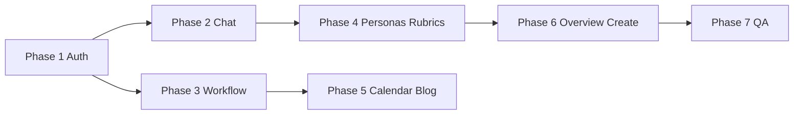

# Neon Dashboard — Backend Integration Plan

**Status:** In progress (Phase 1–4 partially landed on `design-implementation`)
**Branch:** `design-implementation`
**Depends on:** Neon Shell UI migration (atoms/molecules/organisms, Storybook)
**Goal:** Make the new dashboard shell **functional** — real API data, auth enforcement, and existing hooks/services — not mock-only UI.

---

## Problem Statement

The neon redesign replaced shadcn with `Neon*` components but several dashboard routes were implemented as **static/mock shells**:

| Route | Current state | Existing backend integration |
|-------|---------------|------------------------------|
| `/dashboard` | `STAT_CARDS`, `RECENT_ACTIVITIES` constants | `useEditorialAnalytics` (same as analytics page) |
| `/dashboard/chat` | `MOCK_DASHBOARD_*` | `ChatInterface` + `useConversations` + `useSseChat` |
| `/dashboard/workflow` | `WORKFLOW_COLUMNS` mock | `useWorkflowKanban` + `WorkflowKanbanBoard` |
| `/dashboard/calendar` | `buildCalendarDays()` static | `useContentCalendar` |
| `/dashboard/rubrics` | `RUBRICS` constant | `useRubrics` |
| `/dashboard/personas` | `PERSONAS` constant | `usePersonas` |
| `/dashboard/blog-posts` | `MOCK_BLOG_POSTS` | `useBlogPosts` |
| `/dashboard/create` | Static form, no submit | `useCreateCarousel` → `/(create)/create/[id]` |
| `/dashboard/knowledge` | Already wired | `useDocuments` / `KnowledgeBaseInterface` |
| `/dashboard/analytics` | **Already wired** | `useEditorialAnalytics` ✅ |

**Auth:** Middleware exists but `/dashboard/*` is not named explicitly; post-login redirect targets `/chat` (no route — should be `/dashboard/chat`). Editor-only routes omit `/dashboard/create`.

---

## Architecture Principles

1. **Reuse existing hooks** — Do not duplicate API clients; wire pages to `features/*/hooks`.
2. **Adapters at the boundary** — Map API types → `Neon*` props via `features/dashboard/*/adapters/`.
3. **Presentation stays dumb** — Pages orchestrate hooks + neon organisms; no `fetch` in atoms/molecules.
4. **Loading / error / empty** — Every integrated page uses `NeonSpinner`, error copy, and empty states.
5. **Gherkin + tests** — Extend `.feature` files and unit tests when behavior changes.

---

## Phase 1 — Auth & Route Protection (P0)

### Task 1.1 — Harden middleware

**Files:** `src/constants/middleware.ts`, `src/middleware.ts`

- [x] Add `isDashboardRoute(pathname)` helper.
- [x] Require valid JWT for all `/dashboard/*` (middleware redirect when no token).
- [x] Fix authenticated redirect on `/login`: `/chat` → `/dashboard/chat`.
- [x] Extend `isEditorRoute` to include `/dashboard/create`.
- [ ] Add middleware unit tests in `src/constants/middleware.test.ts` (or existing test file).

**Acceptance criteria:**
- Unauthenticated `GET /dashboard` → 307 to `/login`.
- Authenticated `GET /login` → 307 to `/dashboard/chat`.
- Editor role required for `/dashboard/create`.

### Task 1.2 — Dashboard layout auth guard (client)

**Files:** `src/app/dashboard/layout.tsx`, optional `src/features/auth/components/auth-guard.tsx`

- [ ] Optional client guard: redirect to `/login` if `authenticatedFetch` returns 401 (belt-and-suspenders).
- [ ] Show loading shell while verifying session.

---

## Phase 2 — Chat Agent (P0)

### Task 2.1 — Replace mock chat with `ChatInterface`

**Files:** `src/app/dashboard/chat/page.tsx`, subcomponents (keep neon chrome OR wrap `ChatInterface`)

**Options (pick A):**
- **A (recommended):** Thin page renders `<ChatInterface />` inside dashboard layout; deprecate mock subcomponents.
- **B:** Refactor `ChatInterface` to accept neon slot components (sidebar, header).

- [x] Wire `ChatInterface` (`useConversations`, `useSseChat`) on `/dashboard/chat`.
- [x] Remove mock data from production chat page.
- [ ] Keep `chat-interface.test.tsx` green; add dashboard smoke test.

**Acceptance criteria:**
- Send message → SSE stream from `/api/chat/stream`.
- Conversation list loads from `/api/conversations`.
- New chat creates conversation via API.

---

## Phase 3 — Workflow Board (P0)

### Task 3.1 — Wire kanban to API

**Files:** `src/app/dashboard/workflow/page.tsx`, `workflow-adapter.ts`

- [x] Use `useWorkflowKanban()` instead of `WORKFLOW_COLUMNS`.
- [x] Map API via `mapApiWorkflowKanbanToNeon`.
- [ ] Loading: `NeonSpinner`; error: retry `NeonButton`.
- [ ] Card links → `/create/[id]` or workflow detail when ID present.

**Alternative:** Embed existing `WorkflowKanbanBoard` organism and style-match later.

**Acceptance criteria:**
- Board columns match `GET /api/workflow-board`.
- Polling interval from `WORKFLOW_BOARD_POLL_INTERVAL_MS`.

---

## Phase 4 — Personas & Rubrics (P1)

### Task 4.1 — Personas

**Files:** `src/app/dashboard/personas/page.tsx`, `persona-adapter.ts`

- [x] `usePersonas()` for list; map `PersonaProfile` → `NeonPersonaCard` props.
- [ ] Extend adapter: `expertise_areas` → skills, description from API.
- [ ] Create persona → navigate to create flow or modal (reuse existing persona forms if any).

### Task 4.2 — Rubrics

**Files:** `src/app/dashboard/rubrics/page.tsx`, `rubric-adapter.ts`, `rubric-panel.tsx`

- [x] `useRubrics()` for list; map `QualityRubric` → `RubricPanel` via `mapQualityRubricToPanelData`.
- [ ] Preserve neon table UI; drive rows from `rubric.criteria`.

---

## Phase 5 — Calendar & Blog Posts (P1)

### Task 5.1 — Calendar

**Files:** `src/app/dashboard/calendar/page.tsx`, `calendar-adapter.ts`

- [ ] `useContentCalendar(start, end)` for visible month range.
- [ ] Map `CalendarItem[]` onto calendar grid cells.
- [ ] Month navigation updates `start`/`end` query params.

### Task 5.2 — Blog posts list

**Files:** `src/app/dashboard/blog-posts/page.tsx`, `blog-post-adapter.ts`

- [ ] `useBlogPosts({ search, status })` instead of `MOCK_BLOG_POSTS`.
- [ ] `NeonBlogPostCard` + filters wired to hook.

---

## Phase 6 — Dashboard Home & Create (P1)

### Task 6.1 — Overview stats

**Files:** `src/app/dashboard/page.tsx`

- [ ] `useEditorialAnalytics()` for stat cards (mirror `analytics/page.tsx`).
- [ ] Map `summary` → `NeonStatsGrid`; derive activity feed from analytics or `useNotifications` if available.

### Task 6.2 — Create carousel

**Files:** `src/app/dashboard/create/page.tsx`, form sections

- [ ] Wire submit to `useCreateCarousel().mutateAsync`.
- [ ] On success → `router.push(/create/${project.id})` (existing editorial workspace).
- [ ] Or redirect sidebar link to `/(create)/create` until dashboard form is complete.

---

## Phase 7 — QA & Docs (P2)

- [ ] Update `docs/plans/neon-migration-qa-todo.md` — mark integration items.
- [ ] E2E: auth redirect, workflow board load, chat send (Playwright).
- [ ] Remove unused mock-data files or gate behind `NODE_ENV === 'development'` only.
- [ ] Update `frontend/CLAUDE.md` — “dashboard pages must use hooks, not mock constants”.

---

## Implementation Order



| Sprint | Deliverable |
|--------|-------------|
| **Now (PR #1)** | Neon UI commit + this plan + begin Phase 1–2 |
| **Next** | Phases 3–5 |
| **Then** | Phase 6–7 |

---

## Key File Reference

```
frontend/src/
├── middleware.ts
├── constants/middleware.ts
├── features/
│   ├── chat/hooks/use-chat.ts, use-sse-chat.ts
│   ├── chat/components/chat-interface.tsx
│   ├── workflow/hooks/use-workflow-kanban.ts
│   ├── workflow/hooks/use-content-calendar.ts
│   ├── persona/hooks/use-personas.ts
│   ├── rubrics/hooks/use-rubrics.ts
│   ├── blog/hooks/use-blog-posts.ts
│   ├── create/hooks/use-carousel.ts
│   └── analytics/hooks/use-editorial-analytics.ts
└── app/dashboard/
    ├── page.tsx
    ├── chat/page.tsx
    ├── workflow/page.tsx
    └── …
```

---

## Risks

| Risk | Mitigation |
|------|------------|
| API shape ≠ neon card props | Extend adapters; don’t change API |
| `NeonKanbanBoard` vs `WorkflowKanbanBoard` duplication | Single data hook, one presentation component |
| Chat UI regression | Keep `ChatInterface` tests; minimal page diff |
| Role matrix incomplete | Align with `ROLES` in middleware + backend |

---

## Success Metrics

- [ ] All dashboard routes require authentication (verified E2E).
- [ ] Zero production imports of `mock-data.ts` in `app/dashboard/`.
- [ ] Chat, workflow, personas, rubrics show live API data with loading/error states.
- [ ] `npm run test`, `npm run build` pass on `design-implementation`.
