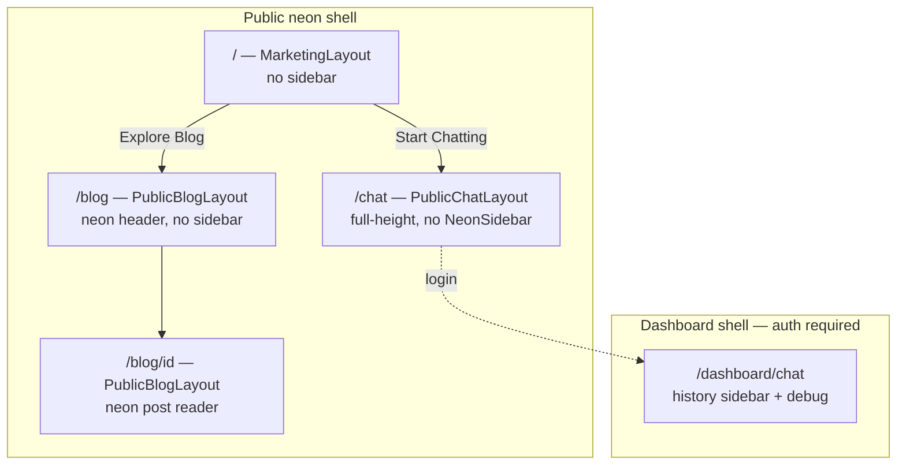

# Public Shell UX Fixes Plan

**Status:** `proposed`
**Branch:** `design-implementation`
**Related:** [Neon Shell Migration](./neon-shell-migration-complete.md), [Frontend Legacy Removal](./frontend-legacy-removal.md)
**Trigger:** QA walkthrough of public homepage, `/chat`, and `/blog` after neon shell work.

---

## Executive summary

Seven UX issues share a common theme: the **public route group** reuses dashboard shell pieces without route-aware variants. The homepage inherited a dashboard-style sidebar; blog routes still use the **v1 `(blog)` layout**; public chat reuses **`DashboardChatView`** (history sidebar + authenticated API hooks). This plan splits **marketing** (`/`), **public chat** (`/chat`), and **public blog** (`/blog/*`) into correct neon templates without changing editor/dashboard behavior.

---

## Issue inventory

| # | Reported issue | Root cause (code) | Severity |
|---|----------------|-------------------|----------|
| 1 | Sidebar on homepage | `(public)/layout.tsx` always renders `NeonSidebar` + `marginLeft` | High |
| 2 | Fake user + logout in sidebar footer | `NeonSidebar` hardcodes Pedro / `admin@alterego.app` / logout (lines 157–224) | High |
| 3 | EN/PT header buttons do nothing | `LanguageSwitch` in public layout links both to `/` — no `locale` cookie (unlike `LanguageSwitcher`) | Medium |
| 4 | Blog links open old design | Homepage links to `/blog/{id}` → `app/(blog)/blog/*` with v1 `Header` + `Container` + `var(--color-*)` | High |
| 5 | Footer tech stack line | `(public)/page.tsx` footer span “Built with Alter-Ego · RAG + …” | Low |
| 6 | Chat header disappears on scroll | Chat lives in scrollable `main` of public layout; `ChatHeader` is not `sticky`; page uses `min-h-screen` not locked viewport | Medium |
| 7 | Conversation history for anonymous users | `PublicChatPage` renders `DashboardChatView` → `useConversations()` + `ChatSidebar` (list requires auth on API) | High |

### Backend note (anonymous chat)

`POST /api/conversations` already supports anonymous users via `get_optional_user` + `anon_token` cookie (`conversations.py`).
`GET /api/conversations` requires **`require_authenticated_user`** — list/history must not be called from public chat UI.

---

## Target information architecture



| Route | Layout | Sidebar | Chat history |
|-------|--------|---------|--------------|
| `/` | Marketing (header only) | None | N/A |
| `/chat` | Public chat (full viewport) | None (internal chat UI only) | **Hidden** — ephemeral session |
| `/blog`, `/blog/[id]` | Public blog (neon) | None | N/A |
| `/dashboard/chat` | Dashboard | `NeonSidebar` + `ChatSidebar` | **Full** (authenticated) |

---

## Phase 1 — Layout split (homepage + sidebar)

### 1.1 Route-group layouts

Replace monolithic `(public)/layout.tsx` with:

| File | Routes | Behavior |
|------|--------|----------|
| `app/(public)/layout.tsx` | All public | Shared `NeonGridBackground`, optional root providers only |
| `app/(public)/(marketing)/layout.tsx` | `/` | Header: logo, Blog, Login, **`LanguageSwitcher`** — **no** `NeonSidebar` |
| `app/(public)/(marketing)/page.tsx` | `/` | Move current homepage here |
| `app/(public)/chat/layout.tsx` | `/chat` | `h-screen overflow-hidden` — no public `NeonSidebar` |
| `app/(public)/blog/layout.tsx` | `/blog/*` | Neon header (same as marketing), no sidebar |

**Alternative (smaller diff):** Keep single layout; pass `showSidebar={pathname !== '/'}` via client wrapper — prefer **route groups** for clearer templates per ADR/neon-shell docs.

### 1.2 `NeonSidebar` variants

Extend `NeonSidebar` (or split `PublicChatSidebar`):

```typescript
interface NeonSidebarProps {
  sections: SidebarSection[];
  showUserFooter?: boolean; // default true for dashboard only
}
```

- **Dashboard** `app/dashboard/layout.tsx`: `showUserFooter={true}` + user from `useAuth()`.
- **Public**: Do not mount `NeonSidebar` on `/` or `/blog` (per IA above).
- Footer block: only render when `showUserFooter && user`; show login CTA link when anonymous (if sidebar ever used on a subset of routes).

**Acceptance (Phase 1)**

- [ ] `/` has no left `NeonSidebar`; content is full width (max-width container unchanged).
- [ ] No “Pedro Marins / admin@alterego.app / logout” on public homepage.

---

## Phase 2 — i18n header fix

### 2.1 Reuse `LanguageSwitcher`

- Remove inline `LanguageSwitch` from public layout.
- Import `LanguageSwitcher` from `@/components/language-switcher` (sets `locale` cookie + reload — same as blog).
- Read locale in marketing/blog layouts from `cookies()` (mirror `(blog)/blog/layout.tsx`).

**Acceptance (Phase 2)**

- [ ] Clicking PT/EN on homepage sets `locale` cookie and reloads with translated `next-intl` messages.
- [ ] Gherkin scenario: language switch on public header.

---

## Phase 3 — Public blog neon migration (remove v1 blog shell)

### 3.1 Problem

| Current | Issue |
|---------|--------|
| `app/(blog)/blog/page.tsx` | v1 `Container`, shadcn semantic colors |
| `app/(blog)/blog/layout.tsx` | v1 `Header` component |
| `app/(blog)/blog/[id]/*` | v1 post chrome |

Homepage already links to `/blog` and `/blog/{id}` — correct URLs, wrong implementation.

### 3.2 Implementation

1. Add **`app/(public)/blog/page.tsx`** — neon list (reuse card styling from homepage “Latest Posts” or extract `NeonBlogPostCard`).
2. Add **`app/(public)/blog/[id]/page.tsx`** — neon reader (adapt existing `blog-post-hero`, `blog-post-content` with neon tokens; drop v1 `Header`).
3. **`next.config.ts` redirects** (optional safety): none needed if routes move under `(public)` same paths.
4. **Delete or deprecate** `app/(blog)/blog/**` after parity check.
5. Update **`frontend-legacy-removal`** guard if `(blog)` group removed.

### 3.3 Blog header rules (from prior requirements)

- Anonymous: **no Chat** in header (marketing/blog header only: Blog, Login, language).
- Authenticated editor: optional link to `/dashboard/*` (footer or subtle “Editor” link) — not in blog header nav for anon.

**Acceptance (Phase 3)**

- [ ] Homepage post links render **neon** list/detail (no `var(--color-primary)` blog shell).
- [ ] `app/(blog)/` route group deleted or empty with redirects.
- [ ] E2E: homepage → `/blog` → post detail uses neon layout.

---

## Phase 4 — Homepage footer cleanup

**File:** `app/(public)/page.tsx` (footer ~1251–1261)

- Remove second `<span>`: “Built with Alter-Ego · RAG + LangGraph + Next.js 16”.
- Keep `© 2026 Pedro Marins` only (or i18n key).

**Acceptance (Phase 4)**

- [ ] Footer does not contain “RAG + LangGraph + Next.js 16”.

---

## Phase 5 — Public chat UX

### 5.1 Sticky chat header

**Files:** `chat-header.tsx`, `dashboard-chat-view.tsx`, `(public)/chat/layout.tsx`

- `ChatHeader`: add `position: sticky; top: 0; z-index: 20; flex-shrink: 0`.
- Public chat layout: `height: 100vh; overflow: hidden; display: flex; flex-direction: column`.
- Chat body: `flex: 1; min-height: 0` (scroll only inside `ChatMessageList`).

### 5.2 `PublicChatView` (new)

**Do not use** `DashboardChatView` on `/chat`.

| Concern | Public behavior | Dashboard behavior |
|---------|-----------------|-------------------|
| Conversation list | **Hidden** — no `ChatSidebar` | `ChatSidebar` + `useConversations()` |
| First message | `createConversation` (anon cookie) | Same + persisted user |
| History API | **Do not call** `GET /conversations` | Full list |
| Refresh | New empty thread (visual reset) | Restore from API |
| Debug/history | N/A | Editor-only `/dashboard/chat` |

**Implementation sketch:**

```
features/dashboard/chat/components/public-chat-view.tsx
  - useState messages (optimistic + SSE)
  - useCreateConversation on first send only
  - useSseChat(conversationId) after create
  - No useConversations
  - Optional banner: “Sign in to save chat history”
```

**Session policy:** On mount, do not hydrate from `useConversationMessages` for prior anon IDs after refresh (fresh `isComposingNew` state). Aligns with “eliminated visually on page refresh”.

### 5.3 Dashboard chat unchanged

`app/dashboard/chat/page.tsx` keeps `DashboardChatView` with full sidebar for authenticated debug/editor use.

**Acceptance (Phase 5)**

- [ ] Public `/chat`: no conversation list column, no search conversations.
- [ ] Scroll messages: header + composer remain visible.
- [ ] Refresh `/chat`: empty thread (no prior messages shown).
- [ ] `/dashboard/chat`: history sidebar still works when logged in.

---

## Phase 6 — Tests & quality gates

### Gherkin (`tests/features/public-shell-ux.feature`)

```gherkin
Feature: Public shell UX

  Scenario: Homepage does not show dashboard sidebar
    When I open "/"
    Then the neon dashboard sidebar is not visible

  Scenario: Public chat does not list conversation history
    When I open "/chat"
    Then the conversation history sidebar is not visible

  Scenario: Language switch sets locale on homepage
    When I switch language to "pt" on the public header
    Then the locale cookie is "pt"

  Scenario: Blog post from homepage uses neon public blog
    When I open "/"
    And I follow the first latest post link
    Then the page does not use the legacy blog Header layout
```

### Unit / E2E updates

| Test | Change |
|------|--------|
| `tests/e2e/home.spec.ts` | No sidebar assertions; blog neon path |
| `tests/e2e/chat.spec.ts` | No “conversation sidebar” for public route |
| `NeonSidebar` test | `showUserFooter` conditional |

### Verification commands

```bash
cd frontend
npm run lint && npm run typecheck && npm run test -- --run
npm run check:legacy
npm run build
docker compose up -d --build frontend
```

---

## File change map (estimated)

| Action | Path |
|--------|------|
| Add | `app/(public)/(marketing)/layout.tsx`, `page.tsx` |
| Add | `app/(public)/chat/layout.tsx` |
| Add | `app/(public)/blog/layout.tsx`, `page.tsx`, `[id]/page.tsx` |
| Add | `features/.../public-chat-view.tsx` |
| Edit | `components/organisms/neon-sidebar.tsx` |
| Edit | `app/dashboard/chat/chat-header.tsx` |
| Edit | `app/(public)/page.tsx` → move + footer trim |
| Delete | `app/(blog)/blog/**` (after migration) |
| Edit | `tests/features/*.feature`, E2E specs |

---

## Acceptance criteria (plan complete)

| ID | Criterion |
|----|-----------|
| P1 | Homepage has no `NeonSidebar` |
| P2 | Sidebar footer shows real user only when authenticated in dashboard |
| P3 | Public EN/PT switches locale via cookie |
| P4 | `/blog` and `/blog/[id]` use neon public layout; v1 `(blog)` removed |
| P5 | Homepage footer omits tech stack line |
| P6 | Public chat header stays visible while scrolling messages |
| P7 | Anonymous users see no conversation history; refresh clears session |
| P8 | Dashboard `/dashboard/chat` retains full history for authenticated users |

---

## Out of scope (this plan)

- Backend changes to anonymous chat (already supports create + cookie).
- Personas/rubrics `window.prompt` → modals (Phase 4 of legacy removal).
- Moving blog **editor** (`/dashboard/blog-posts`) — unchanged.

---

## Suggested implementation order

1. Phase 4 (footer) + Phase 2 (language) — quick wins
2. Phase 1 (layout split, remove homepage sidebar)
3. Phase 5 (public chat view + sticky header)
4. Phase 3 (blog neon migration) — largest surface
5. Phase 6 (tests)

**Estimated effort:** 1–2 days focused frontend work.

---

## Revision history

| Date | Change |
|------|--------|
| 2026-05-29 | Initial plan from user-reported UX audit |
